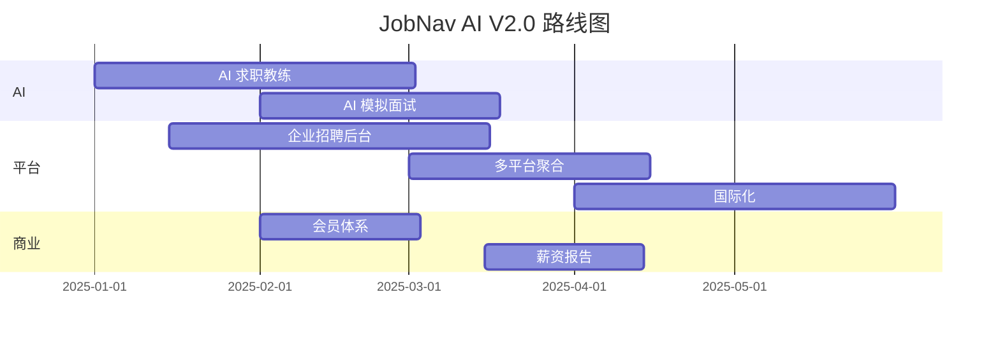

# JobNav AI V2.0 Roadmap

> 上线后迭代计划

---

## 一、AI 能力升级

| 功能 | 优先级 | 说明 |
|------|:------:|------|
| AI 求职教练 | P0 | 全流程 AI 陪伴求职，从岗位搜索到 Offer 选择 |
| AI 模拟面试 | P0 | 语音 + 文字面试模拟，基于真实面经 |
| AI 简历自动生成 | P1 | 基于用户信息一键生成专业简历 |
| Offer 对比分析 | P1 | 多 Offer 横向对比 + AI 推荐 |
| 职业发展规划 | P2 | 基于行业趋势的长期职业路径规划 |

## 二、平台能力扩展

| 功能 | 优先级 | 说明 |
|------|:------:|------|
| 企业招聘后台 | P0 | 企业端：发布岗位、管理内推、查看候选人 |
| 多招聘平台聚合 | P1 | BOSS/猎聘/拉勾 等多平台岗位同步 |
| 多语言国际化 | P1 | 英文版 + 日文版，支持全球求职 |
| 会员体系 | P1 | 免费/Pro/企业 三级会员 |
| 移动端 App | P2 | React Native 跨平台 App |

## 三、数据与商业化

| 功能 | 优先级 | 说明 |
|------|:------:|------|
| 行业薪资报告 | P0 | 基于大数据生成行业薪资分析报告 |
| 招聘市场洞察 | P1 | 热门技能/岗位/城市趋势分析 |
| 企业影响力指数 | P1 | 基于多维度数据的企业综合评价 |
| 内推效果统计 | P1 | 内推转化率、成功率追踪 |
| API 开放平台 | P2 | 第三方开发者接入 |

## 四、技术升级

| 功能 | 优先级 | 说明 |
|------|:------:|------|
| GraphQL API | P1 | 灵活的前端数据查询 |
| 微服务拆分 | P2 | AI/搜索/采集 独立服务 |
| 实时数据管道 | P2 | Kafka/Flink 实时数据处理 |
| 推荐系统 | P2 | 基于用户行为的个性化推荐 |
| A/B 测试平台 | P2 | 产品功能灰度发布 |

## 五、预期里程碑

